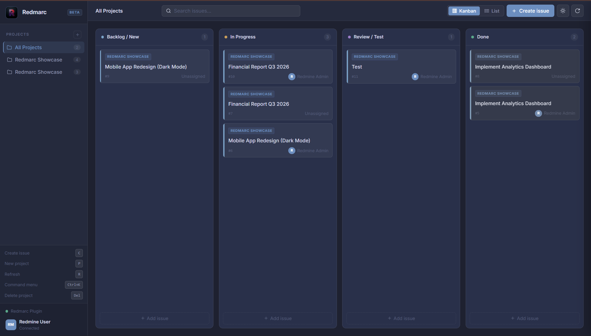
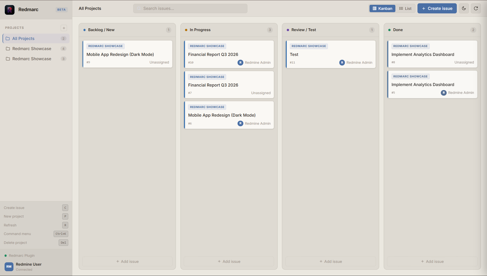

<div align="center">
  
</div>

**Redmarc** is a fast, keyboard-first Single Page Application frontend for [Redmine](https://www.redmine.org/). It replaces Redmine's default interface with a modern, responsive workspace — without touching your data or backend.

> Built by [ArcFront](https://github.com/ArcFrontDev) — we give software the face it deserves.

---

## Screenshots

**Kanban Board — Dark (Slate Studio)**


**Kanban Board — Light (Warm Paper)**


---

## What's New in v0.2

- **Drag & Drop** — Move issues between columns. Status is updated in Redmine automatically.
- **Real Pagination** — Fetches all issues recursively, no 100-issue hard limit.
- **Issue Detail Panel** — Edit priority, due date, estimated hours, and post comments directly from the panel.
- **Activity Journal** — Human-readable change history (names instead of raw IDs).
- **Textile Rendering** — Issue descriptions and comments render bold, italic, code blocks, links, and lists.
- **Redesigned Themes** — "Slate Studio" dark and "Warm Paper" light. No neon, no blur, every surface has its own distinct tone.
- **Refactored Architecture** — DnD logic extracted to a dedicated hook. App.jsx is now a clean orchestrator.

---

## Features

- **Keyboard First** — Full keyboard navigation. `Ctrl+K` opens the command palette.
- **Kanban Board** — Drag and drop issues across status columns with live Redmine sync.
- **List View** — Dense, sortable table view for power users.
- **Issue Detail** — Side panel with inline editing, comment posting, priority and due date controls.
- **Command Palette** — Search issues, switch projects, trigger actions — all without touching the mouse.
- **Dark & Light Themes** — Two carefully crafted palettes. Toggle with a single click.
- **Native Integration** — Installed as a Redmine plugin. Uses your existing session — no API keys needed.
- **Zero Config** — Works out of the box with your existing Redmine projects, issues, and users.

---

## Architecture

Redmarc is a Redmine plugin that intercepts the `/redmarc` route and serves a compiled React (Vite) SPA. Because it runs on the same domain as your Redmine instance, it inherits the session cookie for authentication — no OAuth or token setup required.

```
Browser → /redmarc → Rails plugin → React SPA
                          ↓
                   /issues.json  (Redmine REST API)
                   /projects.json
```

The frontend communicates exclusively through Redmine's public JSON API. The backend plugin is minimal — a single controller, a single route, and an asset manifest.

---

## Installation

### Prerequisites

- Redmine 5.x or newer
- Ruby 3.x
- Node.js 18+ (only if building the frontend yourself)

### Steps

1. **Clone into your Redmine plugins directory**
   ```bash
   cd /path/to/redmine/plugins
   git clone https://github.com/ArcFrontDev/Redmarc.git arcfront
   ```

2. **Install Ruby dependencies**
   ```bash
   bundle install
   ```

3. **Build the frontend** *(skip if using pre-built assets)*
   ```bash
   cd arcfront/frontend
   npm install
   npm run build
   ```

4. **Publish plugin assets**
   ```bash
   bundle exec rake redmine:plugins:assets RAILS_ENV=production
   ```

5. **Restart Redmine**
   ```bash
   touch tmp/restart.txt
   # Or: docker restart <redmine_container>
   ```

6. **Open Redmarc**
   ```
   http://your-redmine-url/redmarc
   ```

---

## Development

```bash
cd plugins/arcfront/frontend
npm install
npm run dev
# → http://localhost:5173/plugin_assets/arcfront/
```

The dev server proxies asset requests. Make sure your Redmine instance is running and you are logged in before opening the dev URL — Redmarc reads the session from the same origin.

---

## Roadmap

- [ ] Gantt / Timeline view
- [ ] Time tracker with live timer
- [ ] Saved filters and custom views
- [ ] Bulk issue actions
- [ ] Analytics dashboard
- [ ] Browser extension mode (no plugin install required)

---

## Contributing

Contributions are welcome. Please read [CONTRIBUTING.md](CONTRIBUTING.md) before opening a pull request.

## License

MIT — see [LICENSE](LICENSE) for details.
