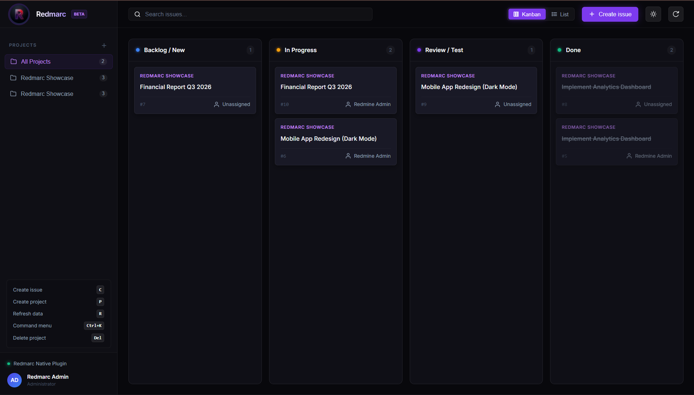
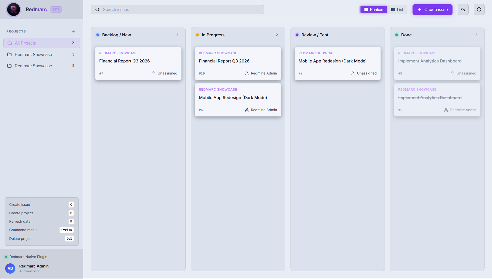

<div align="center">
  
</div>

Redmarc is a modern, fast, keyboard-first, reactive Single Page Application (SPA) frontend for Redmine.
It provides a premium user interface with Kanban boards, command palettes, and a sleek dark mode.

---

### Screenshots

**Kanban Board (Dark Mode)**


**Kanban Board (Light Mode)**


**Command Palette (Ctrl+K)**


---

## Features

- **Keyboard First**: Navigate and operate Redmarc using keyboard shortcuts (e.g. `Ctrl+K` for the command palette).
- **Kanban Board**: Visualize your issues in a modern Kanban board.
- **Premium Design**: Sleek dark and light modes with smooth animations and responsive design.
- **Native Integration**: Installs as a native Redmine plugin, so it uses your existing Redmine session. No need to deal with API keys manually.
- **Zero Config**: Works out of the box with your existing Redmine projects, issues, and users.

## Architecture

Redmarc is built using Ruby on Rails for the backend plugin and React (Vite) for the frontend application.
It intercepts specific routes (like `/redmarc`) in Redmine and serves the compiled React application directly.
Because it runs on the same domain as Redmine, it automatically uses the existing Redmine session cookie for authentication.

## Installation

### Prerequisites
- Redmine 5.x or newer
- Ruby 3.x
- Node.js (only for building the frontend if you are modifying it)

### Steps

1. **Clone the plugin**
   Navigate to your Redmine's `plugins` directory and clone this repository:
   ```bash
   cd /path/to/redmine/plugins
   git clone https://github.com/ArcFrontDev/Redmarc.git arcfront
   ```

2. **Install dependencies**
   Run the following commands to install the necessary Ruby dependencies (if any):
   ```bash
   bundle install
   ```

3. **Install Frontend Assets (Optional if pre-built)**
   If the frontend is not pre-built, navigate to `plugins/arcfront/frontend` and run:
   ```bash
   cd arcfront/frontend
   npm install
   npm run build
   ```

4. **Publish assets**
   Copy the plugin assets into Redmine's public directory so they can be served:
   ```bash
   bundle exec rake redmine:plugins:assets RAILS_ENV=production
   ```
   *Note: The built assets are served from the `public` directory or via the Ruby controller.*

5. **Restart Redmine**
   Restart your Redmine application server so it picks up the new plugin:
   ```bash
   touch tmp/restart.txt
   # Or restart your docker container: docker restart <redmine_container>
   ```

5. **Access Redmarc**
   Open your browser and navigate to:
   ```
   http://your-redmine-url/redmarc
   ```

## Development

To develop the React frontend, navigate to `plugins/arcfront/frontend`:
```bash
cd plugins/arcfront/frontend
npm install
npm run dev
```

The development server will run on port 5173. You must ensure that your `api.js` points to your Redmine instance during development.

## Contributing

We welcome contributions! If you would like to help improve Redmarc, please review our [CONTRIBUTING.md](CONTRIBUTING.md) guide. You can submit pull requests, report issues, or suggest new features.

## License

This project is licensed under the MIT License - see the [LICENSE](LICENSE) file for details.
