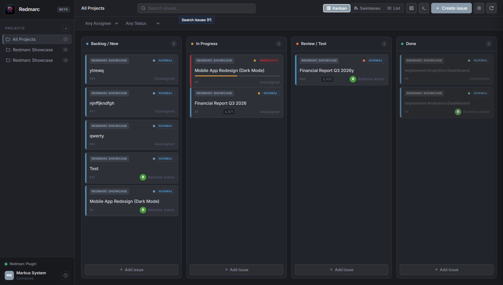
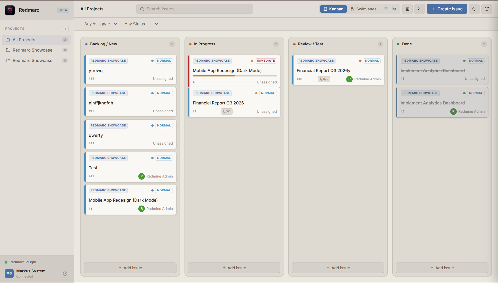
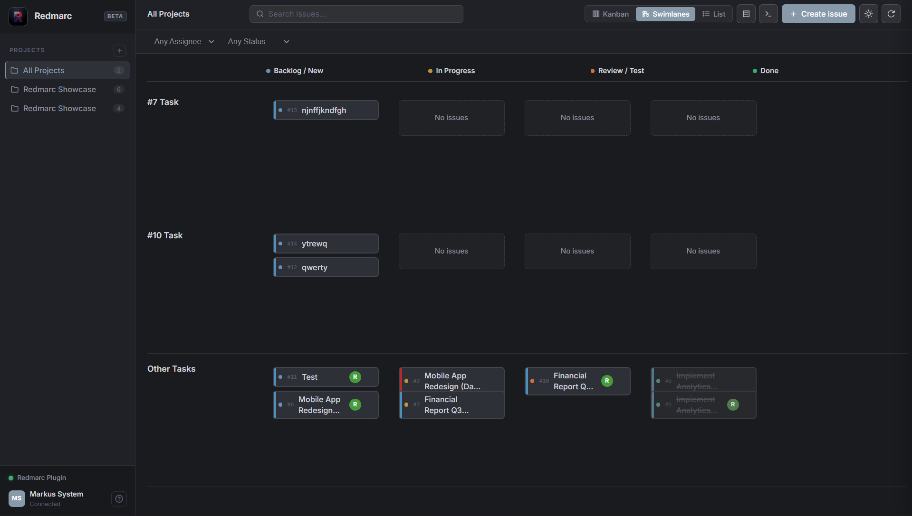

<div align="center">
  
</div>

<div align="center">
  <h1>Redmarc v0.5 Beta (Open Core)</h1>
  <p><strong>A fast, keyboard-first, and stunning SPA frontend for Redmine.</strong></p>
</div>

**Redmarc** is a fast, keyboard-first Single Page Application frontend for [Redmine](https://www.redmine.org/). It replaces Redmine's default interface with a modern, responsive workspace – without touching your data or backend.

> Built by [ArcFront](https://github.com/ArcFrontDev) – we give software the face it deserves.

<details>
<summary><b>Important Notice: Transition to Open Core</b></summary>

> **Redmarc is now an Open Core project.** This repository serves as the foundational open-source core of Redmarc. Going forward, major new features will not be added to this repository. Instead, our focus here will be entirely on **stabilizing, refining, and polishing** the existing feature set.
>
> The only major update planned for the Open Core edition in the future is **full localization** for 6 main languages: English, Russian, Spanish, French, German, and Chinese.

</details>

---

## Screenshots

### Kanban Board – Dark


### Kanban Board – Light


### Swimlanes


---

## What's New in v0.5

* **Docker Sandbox** – Test Redmarc instantly with our automated `docker-compose` environment.
* **Swimlanes** – Group your Kanban board by Assignee, Priority, or Tracker for a better overview.
* **Custom Fields Support** – Seamless integration of your Redmine custom fields in the issue detail panel.
* **Open Core Foundation** – Solidifying the core architecture for community use and future enterprise features.

---

## Features

* **Keyboard First** – Full keyboard navigation. `Ctrl+K` opens the command palette.
* **Kanban Board** – Drag and drop issues across status columns with live Redmine sync.
* **Swimlanes** – Group tasks logically to see who is doing what, or what priority they are.
* **List View** – Dense, sortable table view for power users.
* **Issue Detail Panel** – Edit priority, due date, estimated hours, and post comments directly from the panel.
* **Activity Journal** – Human-readable change history (names instead of raw IDs).
* **Textile Rendering** – Issue descriptions and comments render bold, italic, code blocks, links, and lists.
* **Command Palette** – Search issues, switch projects, trigger actions – all without touching the mouse.
* **Dark & Light Themes** – Two carefully crafted palettes. Toggle with a single click.
* **Native Integration** – Installed as a Redmine plugin. Uses your existing session – no API keys needed.
* **Zero Config** – Works out of the box with your existing Redmine projects, issues, and users.

---

## Try It Instantly (Automated Sandbox)

Want to see Redmarc in action without configuring Ruby, Rails, or PostgreSQL on your host machine? We've created a fully automated sandbox that seeds Redmine with dummy data right out of the box.

### Option 1: 1-Click Cloud Sandbox (No installation required)
Just click and wait for your environment to boot!
[](https://codespaces.new/ArcFrontDev/Redmarc)
[](https://daytona.io/)

### Option 2: Local Docker Sandbox (Requires Docker)
If you have Docker and Docker Compose installed, simply run this command in the root of the repository:

```bash
docker-compose up -d
```

Docker will build the DB, run core migrations, generate secrets, and seed the database. 
Once the containers are running, Redmine will be available at: **`http://localhost:8080`**

**Sandbox Credentials:**
* **Login:** `tester`
* **Password:** `password123`

*(The sandbox automatically creates a "Redmarc Sandbox" project, complete with trackers, statuses, and populated dummy issues!)*

---

## Architecture

Redmarc is a Redmine plugin that intercepts the `/redmarc` route and serves a compiled React (Vite) SPA. Because it runs on the same domain as your Redmine instance, it inherits the session cookie for authentication – no OAuth or token setup required.

```text
Browser → /redmarc → Rails plugin → React SPA
                           ↓
                     /issues.json  (Redmine REST API)
                     /projects.json
```

The frontend communicates exclusively through Redmine's public JSON API. The backend plugin is minimal – a single controller, a single route, and an asset manifest.

---

## Installation

### Prerequisites

* Redmine 5.x or newer
* Ruby 3.x
* Node.js 18+ (only if building the frontend yourself)

### Steps

1. **Clone into your Redmine plugins directory**
   ```bash
   cd /path/to/redmine/plugins
   git clone https://github.com/ArcFrontDev/Redmarc.git arcfront
   ```

2. **Install Ruby dependencies**
   ```bash
   bundle install
   ```

3. **Build the frontend** *(skip if using pre-built assets)*
   ```bash
   cd arcfront/frontend
   npm install
   npm run build
   ```

4. **Publish plugin assets**
   ```bash
   bundle exec rake redmine:plugins:assets RAILS_ENV=production
   ```

5. **Restart Redmine**
   ```bash
   touch tmp/restart.txt
   # Or: docker restart <redmine_container>
   ```

6. **Open Redmarc**
   ```text
   http://your-redmine-url/redmarc
   ```

---

## Development

```bash
cd plugins/arcfront/frontend
npm install
npm run dev
# → http://localhost:5173/plugin_assets/arcfront/
```

The dev server proxies asset requests. Make sure your Redmine instance is running and you are logged in before opening the dev URL – Redmarc reads the session from the same origin.

---

## Roadmap

* [ ] Full localization (English, Russian, Spanish, French, German, Chinese)
* [ ] Gantt / Timeline view
* [ ] Time tracker with live timer
* [ ] Saved filters and custom views
* [ ] Bulk issue actions
* [ ] Analytics dashboard
* [ ] Browser extension mode (no plugin install required)

---

## Contributing

Contributions are welcome. Please read [CONTRIBUTING.md](CONTRIBUTING.md) before opening a pull request.

## License

MIT – see [LICENSE](LICENSE) for details.
